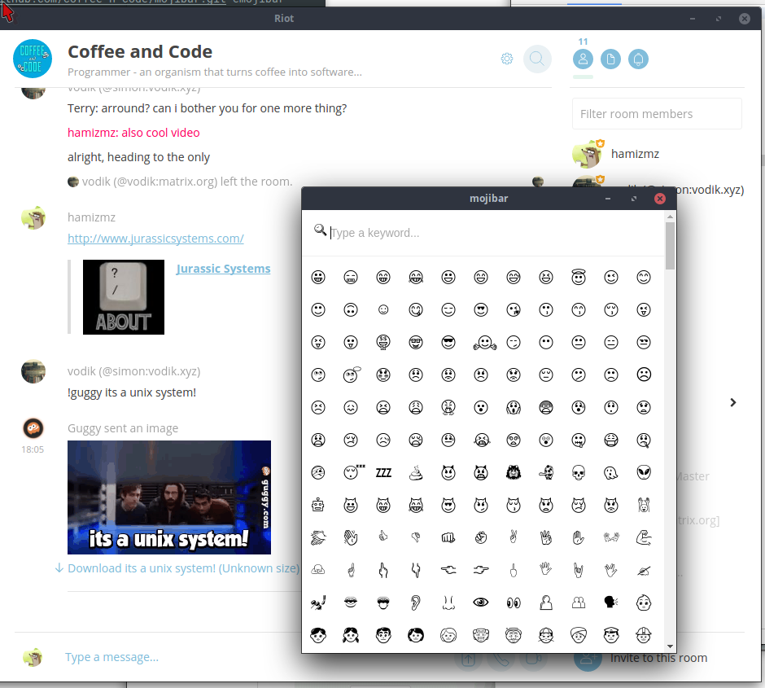

# Mojibar [](https://github.com/feross/standard)

A linux desktop app adapation of [a menubar app](https://github.com/muan/mojibar)
which is an adaptation of [Emoji searcher](http://emoji.muan.co).



## INSTALL

NOTE: Requires electron in order to run:

```
$ npm install -g electron # That should do the trick!
```

```
$ git clone https://github.com/coffee-n-code/mojibar.git && cd mojibar
```

```
$ sudo ./install-desktop-linux
```

## :heart: